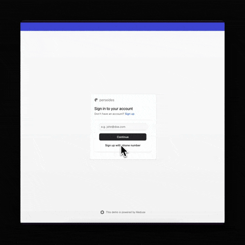

<p align="center">
  <a href="https://www.github.com/perseidesjs">
  <picture>
    <source media="(prefers-color-scheme: dark)" srcset="./.github/assets/dark_mode.png" width="128" height="128">
    <source media="(prefers-color-scheme: light)" srcset="./.github/assets/light_mode.png" width="128" height="128">
    
    </picture>
  </a>
</p>
<h1 align="center">
  @perseidesjs/auth-otp
</h1>

<p align="center">
  <a href="https://www.npmjs.com/package/@perseidesjs/auth-otp"></a>
  <a href="https://www.npmjs.com/package/@perseidesjs/auth-otp"></a>
  <a href="https://github.com/perseidesjs/auth-otp/blob/develop/LICENSE.md"></a>
  
  
</p>

<h4 align="center">
  <a href="https://perseides.org">Website</a> |
  <a href="https://docs.perseides.org/plugins/auth-otp/getting-started">Documentation</a> |
  <a href="https://www.medusajs.com">Medusa</a>
</h4>

<p align="center">
  Implement seamlessly OTP-based authentication for Medusa 2.x
</p>

<p align="center">
  
</p>

## Installation

```bash
npm install @perseidesjs/auth-otp
# or
yarn add @perseidesjs/auth-otp
# or
pnpm add @perseidesjs/auth-otp
```

## Documentation

Access the full documentation at [https://docs.perseides.org/docs/plugins/auth-otp/getting-started](https://docs.perseides.org/docs/plugins/auth-otp/getting-started)

## License

MIT
